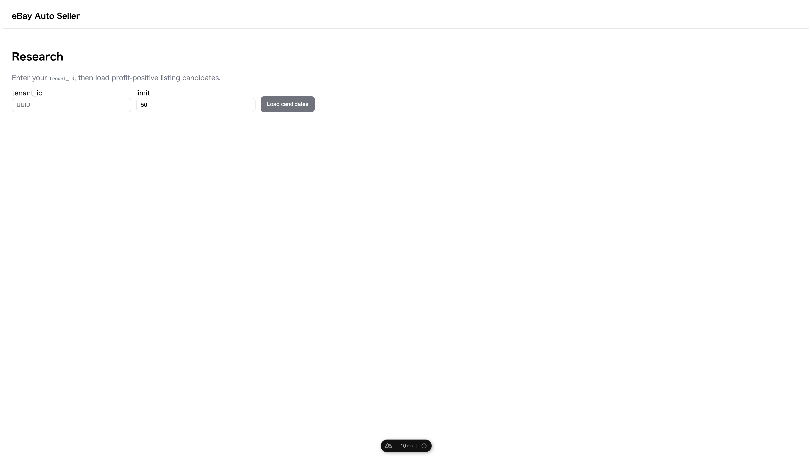
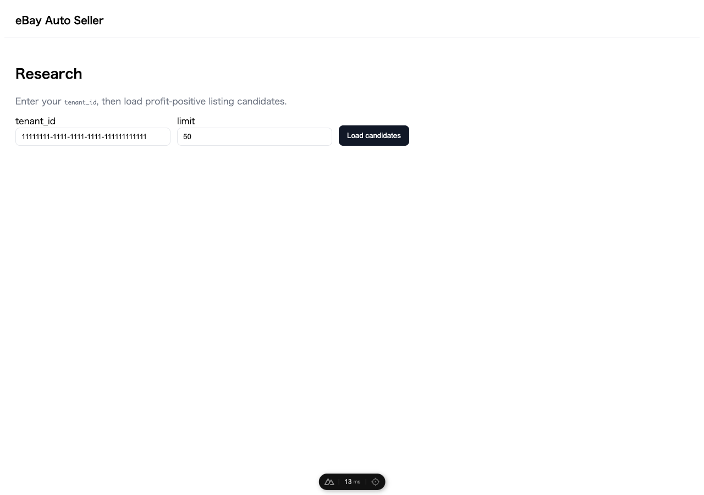
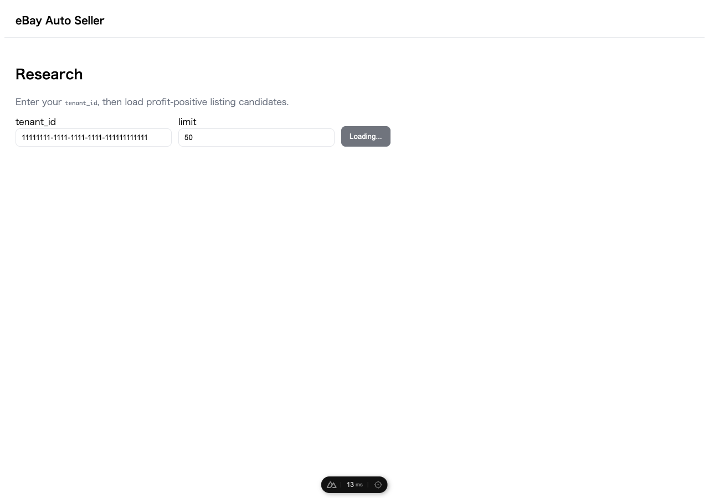

# Web UI 操作マニュアル（現状実装ベース）

最終更新: 2026-04-26

## 1. 対象

このマニュアルは、`apps/web` の現行実装に基づく画面操作手順をまとめたものです。  
現時点で利用できる主要画面は以下の 2 つです。

- Dashboard 画面（`/`）
- Research 画面（`/research`）

## 2. 起動とアクセス

1. プロジェクトルートで Web 開発サーバーを起動します。  
   `cd apps/web && npm run dev`
2. ブラウザで `http://localhost:3001` にアクセスします。  
   （`3000` が使用中の場合、Nuxt が別ポートに切り替えることがあります）

## 3. 画面一覧とできること

## 3.1 Dashboard 画面（`/`）

表示内容:

- ヘッダー: `eBay Auto Seller`
- 見出し: `Dashboard`
- 説明文: `Start your research and listing workflow.`
- リンク: `Go to Research`

できること:

- `Go to Research` をクリックして、調査候補の取得画面に遷移できます。

スクリーンショット:


## 3.2 Research 画面（`/research`）

表示内容:

- 入力欄 `tenant_id`（文字列）
- 入力欄 `limit`（数値、初期値 50、最小 1、最大 500）
- ボタン `Load candidates`
- エラー表示領域（`Failed: ...`）
- 候補一覧カード（取得成功時のみ表示）

できること:

- 指定した `tenant_id` の候補データを API から取得し、利益関連指標を一覧で確認できます。

スクリーンショット:



## 4. 基本操作手順（Research）

1. `tenant_id` に対象テナント ID を入力します。  
   未入力の間は `Load candidates` ボタンが無効です。
2. 必要に応じて `limit` を設定します。  
   1〜500 の範囲で指定してください。
3. `Load candidates` をクリックします。
4. 取得中はボタン表示が `Loading...` になります。
5. 取得成功時、候補カードが一覧表示されます。

### 4.1 操作画面の例（`tenant_id` 入力後）

`tenant_id` を入力すると `Load candidates` が有効になります。  
（URL に `?tenant_id=<UUID>` を付けて開いた場合も、入力欄に同じ値が入った状態と同等です。）



### 4.2 操作画面の例（`Load candidates` 実行後）

`Load candidates` を押したあとの画面です。

- API が成功し候補がある場合: 画面下部にカード一覧が表示されます（後述「結果の見方（候補カード）」）。
- API が失敗した場合: `Failed: ...` のエラー文言が表示され、一覧は空になります。



## 5. 結果の見方（候補カード）

各カードには以下が表示されます（通貨は USD 表示、少数 2 桁）。

- Product title
- Variant name
- Avg sold
- Item cost
- Shipping
- eBay fee
- Sales tax
- Net profit

`Net profit` が実質的な利益確認の中心項目です。

## 6. エラー時の挙動

- API 呼び出しに失敗した場合、画面上部に `Failed: <エラーメッセージ>` が表示されます。
- エラー発生時は候補一覧がクリアされます。

## 7. API 呼び出し仕様（画面観点）

Research 画面の `Load candidates` 実行時、以下の GET リクエストを送信します。

- パス: `/research/candidates`
- クエリ: `tenant_id`, `limit`

`NUXT_PUBLIC_API_BASE_URL` が設定されている場合は、その URL を先頭に付けて呼び出します。  
未設定の場合は同一オリジン相対パス（`/research/candidates`）で呼び出します。

## 8. スクリーンショットの再取得（開発者向け）

ドキュメント用の Research 画面キャプチャを撮り直す場合:

```bash
cd docs/scripts && npm install && node capture-research-screenshots.mjs
```

事前に `apps/web` で `npm run dev` を起動し、表示 URL が異なる場合は `WEB_BASE_URL` を指定してください（既定は `http://localhost:3001`）。

## 9. 現時点の制約・注意点

- Dashboard はプレースホルダーに近い簡易画面です。
- Research は「候補取得と表示」にフォーカスしており、現時点では編集・保存・出品実行機能はありません。
- `tenant_id` の内容チェックは最小限のため、入力値の妥当性は API 側判定に依存します。
